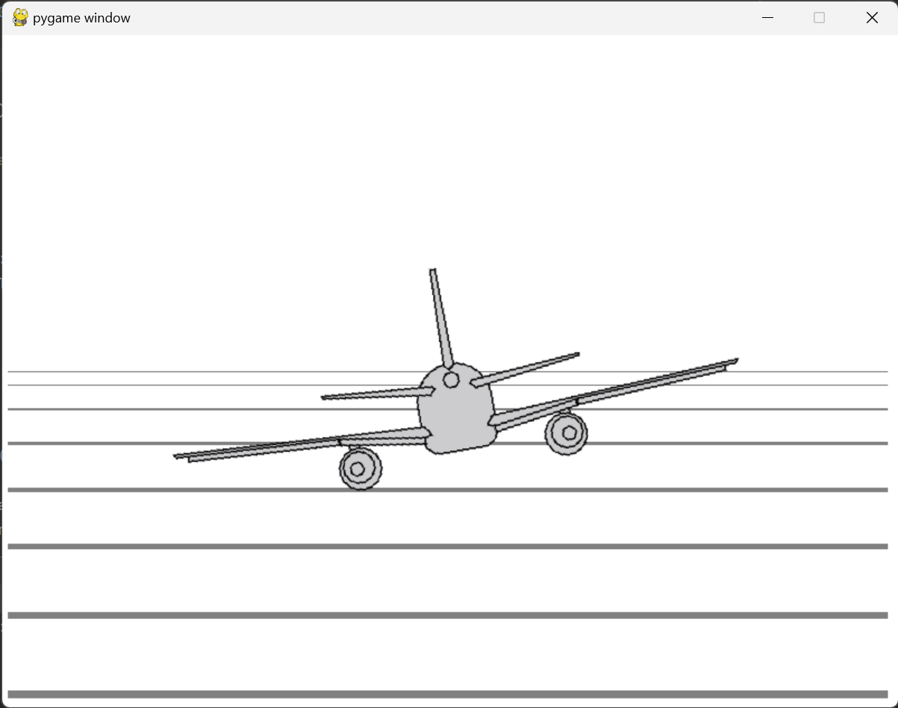

# Python flight simulator

Reads data from arduino and sends it to flight simulator.

## Connect arduino

* Connect potentiometer to A0 (and +5V and GND)
* Upload `arduino/arduino.ino` to arduino

## Run python script

* Install python requirements: `pip install -r requirements.txt`
* Run python script: `python main.py`
